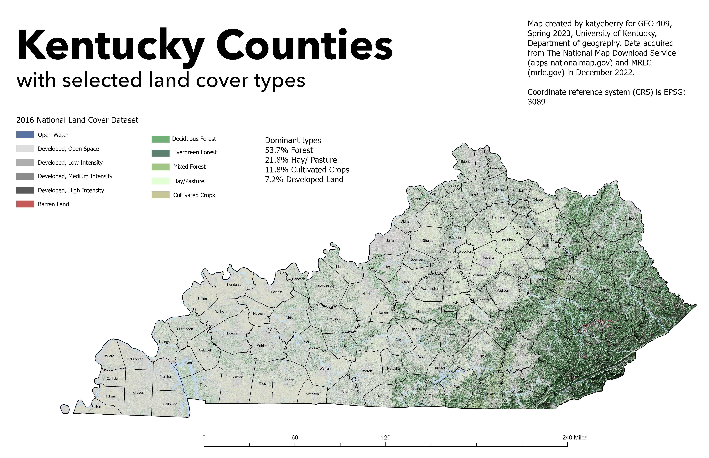
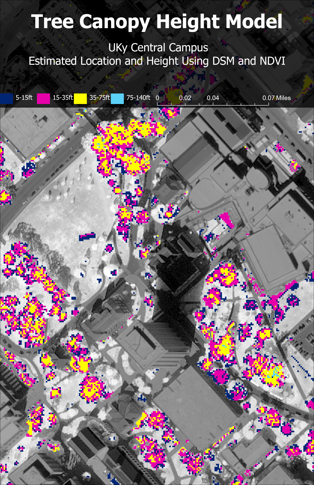

# geo409-field-trip-maps
Selected maps of Kentucky and locations therein

View and downlaod maps: [link](https://katyeberry.github.io/geo409-field-trip-maps/)

# GEO409 Field Trip Maps
Maps for field trip to measure tree canopy

   
Kentucky counties with selected land cover types – [Download geospatial PDF](Ky-landcover.pdf)

   
UKy central campus canopy model – [Download geospatial PDF](CampusCanopy.pdf)

Maps created by katyeberry for GEO409, Spring 2023, University of Kentucky Department of Geography

